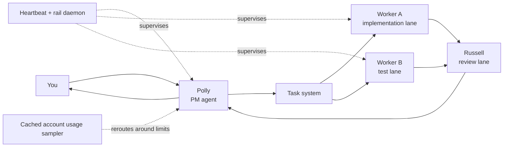
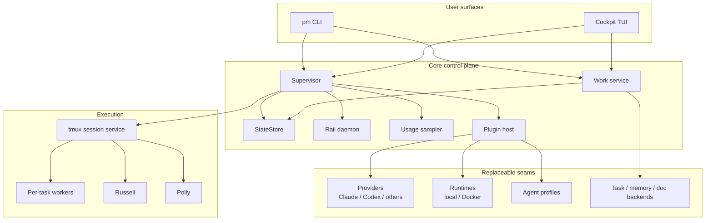

# PollyPM

**Stop babysitting your AI.**

PollyPM is a `tmux`-first control plane for running a **team of AI coding agents** on the Claude and Codex subscriptions you already pay for. Instead of one long, fragile chat, you get a managed system: Polly dispatches work, workers implement in isolated worktrees, Russell reviews, the heartbeat watches for trouble, and the cockpit shows you what is actually happening.

It is local-first, repo-aware, and built as a **modular monolith**: one system, explicit seams, swappable parts.

Start here: [docs/getting-started.md](docs/getting-started.md)

## Why PollyPM

### A PM agent, not just more tabs

Most AI coding setups leave you managing the agents yourself. PollyPM adds a manager to the loop. Polly creates tasks, keeps workers fed, routes review, escalates blockers, and tells you when a decision actually needs you.

### Subscription-native, not API-metered

PollyPM wraps the CLI tools you are already using, instead of forcing everything through a separate API billing stack. The point is not abstract orchestration. The point is making heavy multi-agent workflows economically reasonable.

### Specialization beats one-model-everywhere

Claude and Codex are good at different things. PollyPM lets you use them by role: one session can plan, another can implement, another can review. The value is not raw parallelism. The value is better work getting through the loop.

### Your state lives with your code

Plans, docs, prompts, task state, worktrees, logs, and project memory stay local and inspectable. You are not shipping your operating context into a black box and hoping it survives.

## What It Feels Like

```text
you: build the new auth flow and add tests
polly: on it. launching claude on the auth lane and codex on tests.
polly: auth session shipped. queued review.
russell: rejected first pass. missing empty-state coverage.
polly: sent it back with the exact fix. new review is ready.
```

That is the product: not just “AI wrote code,” but “a managed loop kept moving until the work was actually ready.”

## How It Works



### The operating model

1. You give Polly a goal.
2. Polly turns that into scoped tasks.
3. Workers claim tasks and execute in isolated git worktrees.
4. Russell approves or rejects the result.
5. Polly keeps the whole thing moving and only pulls you in when a real decision is needed.

## What You Get

- A real cockpit UI with task review, session visibility, timestamps, live peeks, and settings.
- Per-task worker sessions instead of one giant shared lane.
- Automatic health checks and crash recovery.
- Account usage caching and provider rotation when limits hit.
- Plan review flow with explicit approval gates.
- Repo-local docs, rules, memory, and project context.
- Replaceable providers, runtimes, profiles, storage backends, and plugins.

## System Shape



## The Core Ideas

### 1. Worktrees are the safety boundary

Parallel agents should not collide in one checkout. PollyPM uses isolated git worktrees so one worker can ship a feature while another fixes tests without trampling the same branch.

### 2. Health has to be explicit

If an agent stalls, silently loops, loses quota, or crashes, that is not “background magic.” It is an operating problem. PollyPM surfaces those states and reacts to them.

### 3. Prompts should be hot, not bloated

The live role prompts carry the operating contract. Long manuals and edge-case catalogs stay in docs and `pm help`, where they remain available without consuming every session’s context window.

### 4. Modularity matters

PollyPM is intentionally built so major seams are replaceable: providers, runtimes, session services, agent profiles, storage backends, scheduler hooks, and cockpit panes. The goal is not microservices. The goal is a system you can evolve without tearing apart.

## Install From Source

**Step 1 — preflight.** Before cloning anything, verify your machine has every
dep PollyPM needs (python 3.11+, uv, tmux, git, at least one of the provider
CLIs). The preflight script lists missing items with OS-specific install hints
so you fix them all at once instead of one `command not found` at a time:

```bash
curl -sSL https://raw.githubusercontent.com/samhotchkiss/pollypm/main/scripts/preflight.sh | bash
```

(Or, if you already cloned the repo: `bash scripts/preflight.sh`.)

**Step 2 — install.** Once preflight is green:

```bash
git clone https://github.com/samhotchkiss/pollypm ~/dev/pollypm
cd ~/dev/pollypm
uv pip install -e .
pm doctor
pm
```

After onboarding:

```bash
pm                  # attach to the main cockpit
pm cockpit          # open the Textual cockpit explicitly
pm status           # session and health overview
pm send operator "Build a weather CLI with current conditions and a 5-day forecast"
pm down             # stop PollyPM cleanly
```

If you want the full first-run walkthrough, use [docs/getting-started.md](docs/getting-started.md).

## Good Fit, Bad Fit

### PollyPM is a good fit if:

- you already use Claude Code, Codex CLI, or both
- you want several lanes of work moving at once
- you care about review, isolation, and recoverability
- you want local control instead of a SaaS black box

### PollyPM is probably not the right fit if:

- you want a single-agent IDE copilot and nothing else
- you do not want to operate through terminal sessions
- you are looking for a hosted “done for you” cloud agent product

## For Contributors

The repo is product-facing at the top and engineering-heavy underneath.

Load-bearing surfaces:

- Core role prompts: `src/pollypm/plugins_builtin/core_agent_profiles/profiles.py`
- Worker protocol injection: `src/pollypm/memory_prompts.py`
- Per-task worker bootstrap: `src/pollypm/work/session_manager.py`
- Session orchestration: `src/pollypm/supervisor.py`
- Work state machine: `src/pollypm/work/sqlite_service.py`
- Cockpit shell: `src/pollypm/cockpit_ui.py`

Contributor rules of thumb:

- keep hot prompts short and behavioral
- put reference material in docs, not every session prompt
- preserve replaceable boundaries
- make module inputs and outputs explicit
- add tests when prompt assembly or orchestration behavior changes

## Docs

- [docs/getting-started.md](docs/getting-started.md)
- [docs/worker-guide.md](docs/worker-guide.md)
- [docs/architecture.md](docs/architecture.md)
- [docs/plugin-authoring.md](docs/plugin-authoring.md)
- [docs/plugin-discovery-spec.md](docs/plugin-discovery-spec.md)
- [docs/plugin-boundaries.md](docs/plugin-boundaries.md)
